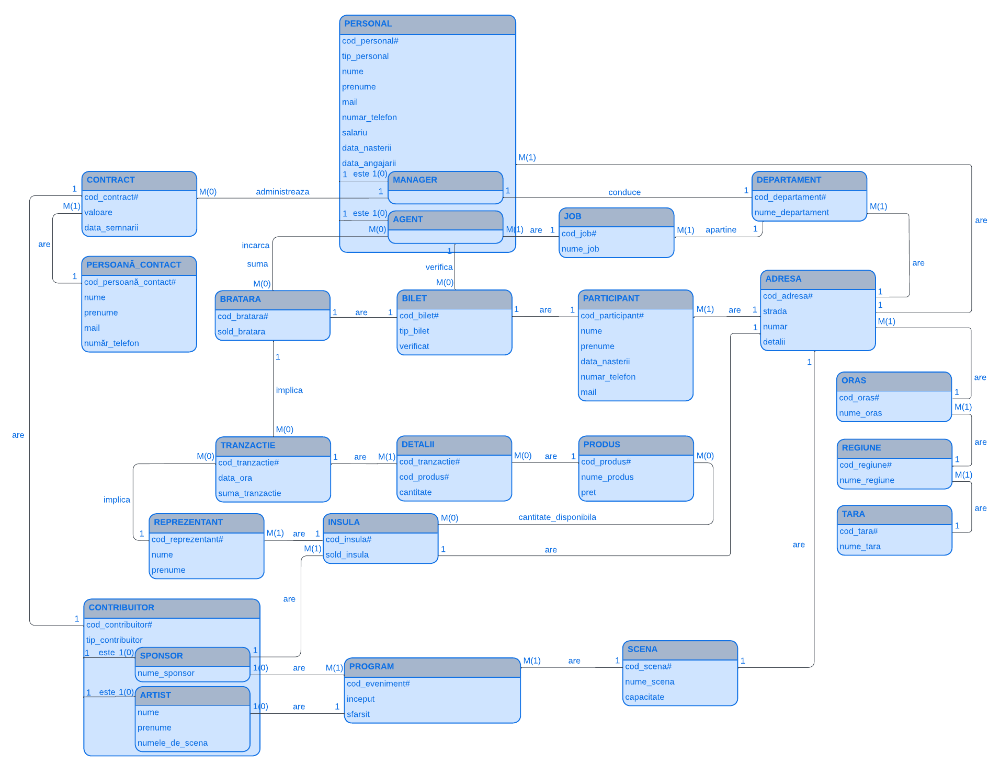
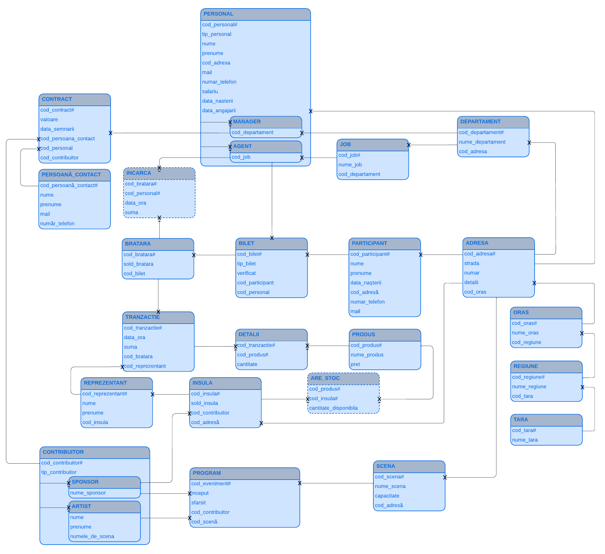

# BREEZE Database Management System

BREEZE is an Oracle-based relational database system designed to model and automate the operations of a large-scale music festival.

The system manages personnel, artists, sponsors, event scheduling, participants, ticketing, electronic wristbands, inventory, payments and auditing. Business rules are enforced at database level using PL/SQL procedures, functions, packages and triggers.

## Tech Stack

- Oracle Database 19c
- SQL
- PL/SQL
- Docker
- SQL*Plus

## Key Features

- Relational data model with primary, foreign key, uniqueness and check constraints
- Event scheduling with stage-overlap prevention
- Ticket validation and non-transferability enforcement
- Electronic wristband payments and balance management
- Product inventory and transaction processing
- Audit logging using autonomous transactions
- Controlled DDL operations through maintenance sessions
- Transactional workflows using row locking and savepoints

## Database Architecture

The schema connects festival operations across staffing, scheduling, admission and sales. Wristbands link ticket holders to payments; transactions connect purchases to products, stock and sponsor-operated sales points.

### Entity-Relationship Diagram



### Conceptual Schema



## Notable Database Logic

| Capability | Implementation |
| --- | --- |
| Event scheduling | `t_program_fara_suprapunere` rejects overlapping stage events on INSERT; `t_program_artist` limits each artist to one performance. |
| Ticket validation | `t_bilet_validat_insert` and `t_bilet_validare_update` require an agent to validate a ticket and prevent reverting a validated ticket to its unvalidated state. |
| Persistent audit logging | `p_suspiciune` uses an autonomous transaction to record suspicious attempts even when the triggering operation is rejected. |
| Non-transferable tickets | `t_blocare_update_bilet` blocks ticket reassignment; `t_blocare_update_participant` protects participant identification fields. |
| DDL control | `t_control` gates CREATE/ALTER/DROP through `pkg_mentenanta`; maintenance activity is recorded in `MENTENANTA`. |
| Wristband top-ups | `t_incarcare_bratara` checks staff authorization and credits the wristband balance. |
| Payments and inventory | `p_tranzactie_produs` and `pkg_comenzi` debit wristbands, reduce stock, credit sales points and record purchases. The package adds a cart, electronic receipt, `FOR UPDATE` row locking and `SAVEPOINT` rollback. |
| VIP access and reporting | `acces_VIP` checks eligibility, occupancy and duplicate entry. Stored subprograms generate schedules, check product availability and retrieve department manager contacts. |

## Repository Structure

```text
breeze-database-management-system/
├── README.md
├── database/
│   ├── 01_schema.sql
│   ├── 02_procedures.sql
│   ├── 03_functions.sql
│   ├── 04_seed_data.sql
│   ├── 05_triggers.sql
│   └── 06_tests.sql
├── docs/
│   ├── BREEZE_Documentation.pdf
│   ├── er-diagram.png
│   └── conceptual-schema.png
└── docker/
    └── README.md
```

| File | Purpose |
| --- | --- |
| [01_schema.sql](database/01_schema.sql) | Tables, constraints and sequences |
| [02_procedures.sql](database/02_procedures.sql) | Stored procedures and PL/SQL packages |
| [03_functions.sql](database/03_functions.sql) | Standalone stored functions |
| [04_seed_data.sql](database/04_seed_data.sql) | Initial dataset |
| [05_triggers.sql](database/05_triggers.sql) | Business rules, auditing and DDL controls |
| [06_tests.sql](database/06_tests.sql) | Positive and negative demonstration scenarios |

Package functions remain with their package specifications and bodies in `02_procedures.sql` to preserve their interfaces and shared state.

## Installation

Follow the [Docker and connection guide](docker/README.md) to connect to an Oracle 19c PDB. Use an **empty project schema** with `CREATE SESSION`, `CREATE TABLE`, `CREATE SEQUENCE`, `CREATE PROCEDURE`, `CREATE TRIGGER` and a tablespace quota.

From the repository root, run the scripts in numerical order in SQL*Plus:

```sql
@database/01_schema.sql
@database/02_procedures.sql
@database/03_functions.sql
@database/04_seed_data.sql
@database/05_triggers.sql

SELECT object_name, object_type, status
FROM user_objects
WHERE status = 'INVALID';

SELECT name, type, line, position, text
FROM user_errors
ORDER BY name, sequence;
```

Both verification queries should return no rows. In SQL Developer, use **Run Script (F5)** in the same order.

Procedures are installed before the seed data because seeding calls the payment procedure. Triggers are installed afterward because the seed already adjusts initial wristband balances. The DDL control trigger is created last so it does not block installation.

Installation scripts stop on SQL errors; check `USER_ERRORS` separately for PL/SQL compilation failures. Installation is not idempotent. DDL and some procedures commit changes, so a failed installation cannot be fully undone with ROLLBACK.

## Testing

Run [06_tests.sql](database/06_tests.sql) selectively or as a sequential demonstration in a disposable test schema after installation:

```sql
@database/06_tests.sql
```

Scenarios cover scheduling conflicts, rejected ticket operations, VIP access, reporting, audit persistence, top-ups, maintenance and payments with insufficient stock or funds. Expected errors are allowed to continue; inspect messages and database effects against the scenario comments and documentation.

These are manual demonstrations, not an automated pass/fail suite. They modify data, commit transactions and create a `TEST` table. Autonomous audit records persist, and reruns may produce different results.

**Validation status:** The original project was developed and executed on Oracle Database 19c. The reorganized repository has been statically reviewed but has not yet been revalidated against a fresh Oracle instance.

## Known Limitations

- Stage-overlap validation covers INSERT, not event time changes through UPDATE.
- VIP occupancy and shopping carts use session-specific package state.
- Maintenance mode is a session-level DDL gate, not a separate authorization system.
- VIP age checks depend on `SYSDATE`, so demonstration outcomes can change over time.

## Documentation

[Full Documentation](docs/BREEZE_Documentation.pdf) is available in Romanian and includes the relational model, integrity rules, PL/SQL implementation and demonstration scenarios. The diagrams above are exported from pages 24 and 25.

## Project Context

Developed as part of the Database Management Systems coursework at the University of Bucharest, 2025–2026.

## Author

Pal Robert-Attila
